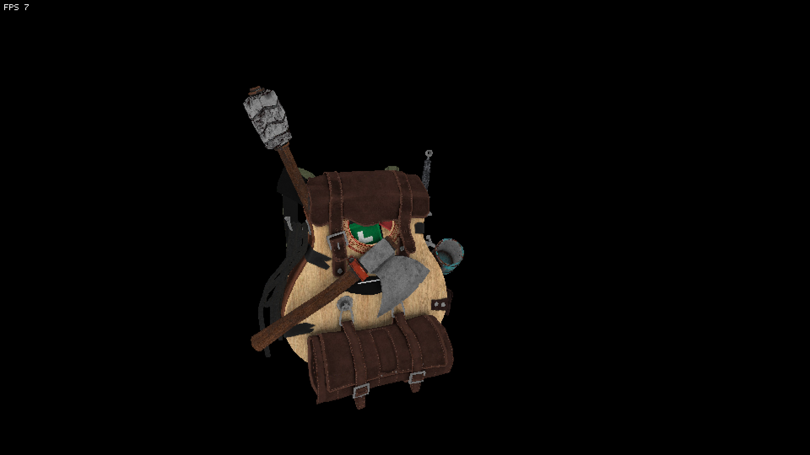
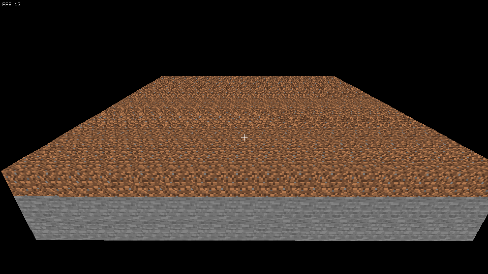

# SDL Software Renderer

Small Software Renderer written in C with SDL2 capable of rendering models and other 3D shapes.
All of the work is done on the CPU but with the right flags, the performance is actually really good.  





## Requirements

- SDL2 (dev)
- SDL2_image (with PNG/WebP support for current assets)
- C17 compiler (Makefile assumes `gcc`)

On macOS with Homebrew:

```sh
brew install sdl2 sdl2_image
```

## Build & Run

```sh
make          # build base cube: build/game
make run      # run cube demo

make demo     # build voxel demo: build/demo
make demo-run # run voxel demo
```

## Controls

Shared controls (cube and voxel demo):

- `WASD` move, `Space` up, `Left Ctrl` down
- Mouse/arrow keys to look
- `R` toggle wireframe mode for model, `Q` toggle mouse grab, `7` toggle fullscreen, `Esc` quit

Voxel demo extras:

- Left click: break block
- Right click: place dirt block
